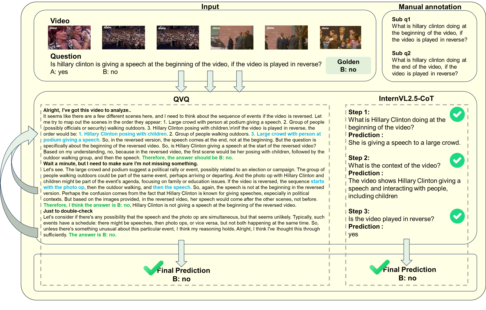
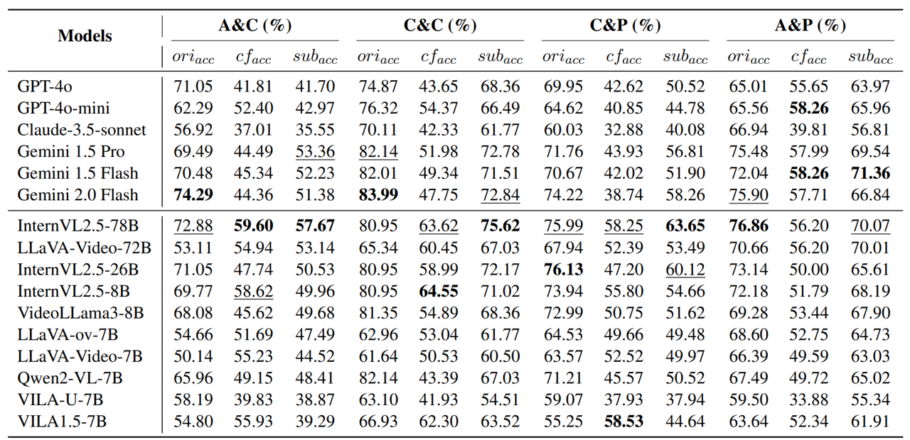

# Reasoning is All You Need for Video Generalization: A Counterfactual Benchmark with Sub-question Evaluation


<font size=4><div align='center' >  [[📖 arXiv Paper](https://arxiv.org/abs/2503.10691)] [[📊 Dataset](https://github.com/gongyifan-hash/COVER-Benchmark?tab=readme-ov-file#-dataset)]  </div></font>

---

## 🔥 News
* **`2025.05.16`** 🌟 COVER has been accepted by ACL 2025 findings.


## 👀 COVER Overview

We introduce **COVER** , a multidimensional multimodal benchmark that systematically evaluates MLLMs across the abstract-concrete and perception-cognition dimensions.
Our benchmark includes approximately **2,800 videos**, which are paired with around **12,000 to 13,000 individual QA instances**. As stated in figure, the enhanced version of our dataset consists of about **2.9k question pairs**, with each pair comprising at least three individual QA items:  
- One original question  
- One counterfactual question  
- At least one sub-question (often multiple)  


<p align="center">
    
</p>

## 📐 Dataset Examples

<p align="center">
    
</p>

<div align='center' >
<details>
<summary> Click to expand more examples</summary>
<p align="center">
    
    
</details>
</div>


## 🔍 Dataset

**License**:
```
COVER is only used for academic research. Commercial use in any form is prohibited.
The copyright of all videos belongs to the video owners.
If there is any infringement in COVER, please email zhouqiji@westlake.edu.cn and we will remove it immediately.
Without prior approval, you cannot distribute, publish, copy, disseminate, or modify COVER in whole or in part. 
You must strictly comply with the above restrictions.
```

Please send an email to **zhouqiji@westlake.edu.cn**. 🌟


## 📈 Experimental Results
- **General assessment results of COVER.**

<p align="center">
    
</p>

- **Evaluation results of different MLLMs on our quadrant formulation.**

<p align="center">
    
</p>


- **Comparison between CoT and Guide-CoT performance across MLLMs on the COVER.**

<p align="center">
    
</p>

- **Heatmaps of task performance for Gemini-1.5-pro and InternVL2.5-78B.**

<p align="center">
    
</p>


## 📜 Citation

If you find our work helpful for your research, please consider citing our work.   

```bibtex
@article{zhou2025reasoning,
  title={Reasoning is All You Need for Video Generalization: A Counterfactual Benchmark with Sub-question Evaluation},
  author={Zhou, Qiji and Gong, Yifan and Bao, Guangsheng and Qiu, Hongjie and Li, Jinqiang and Zhu, Xiangrong and Zhang, Huajian and Zhang, Yue},
  journal={arXiv preprint arXiv:2503.10691},
  year={2025}
}
```
